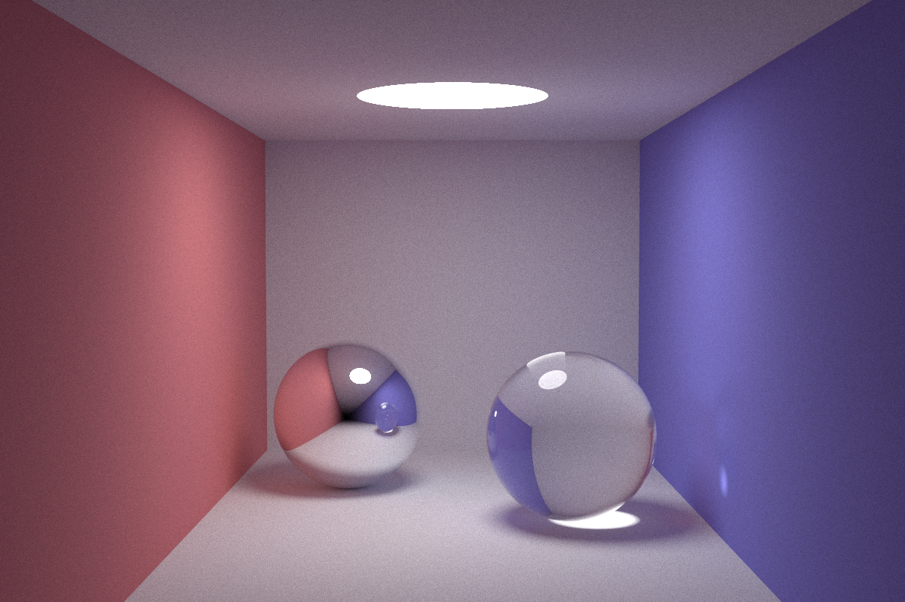
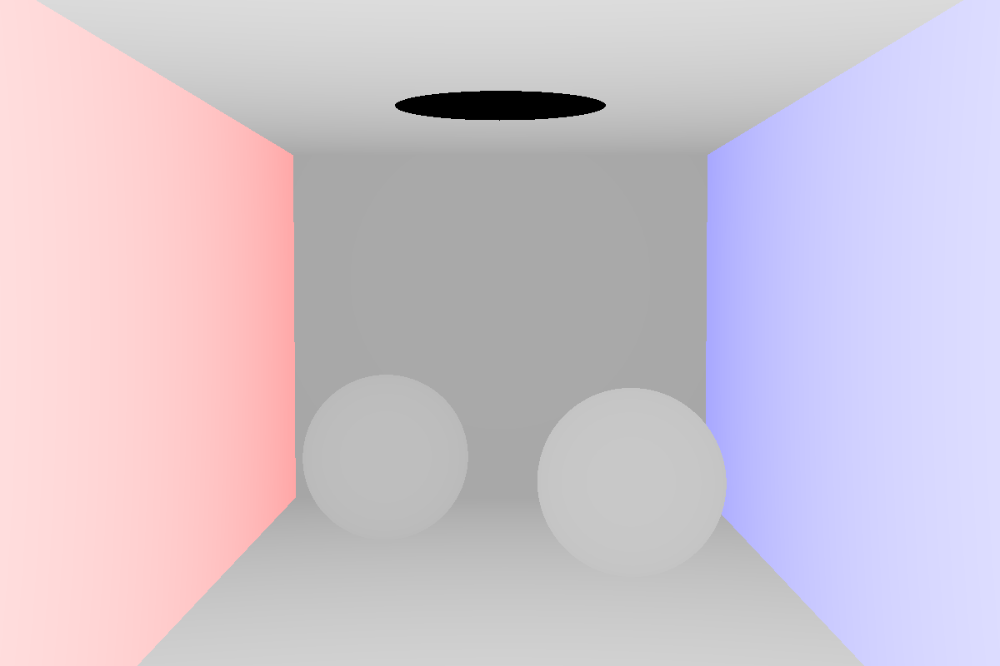
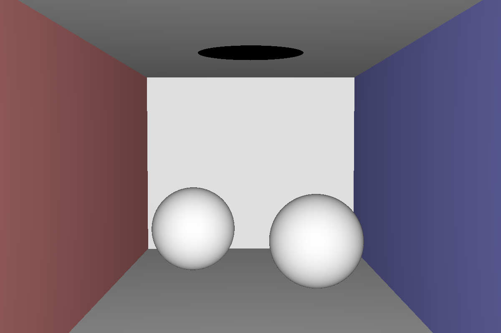
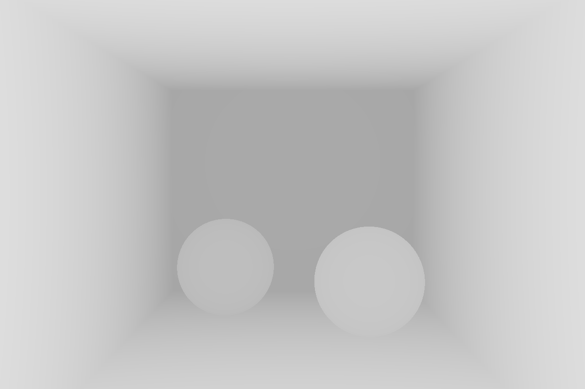

# rust-raytrace
## abstract
[三葉レイちゃん](https://twitter.com/mitsuba_rei)のこちらの動画  
[【レイトレ】CG技術系バーチャルYoutuber、レイトレーシングしてみた](https://www.youtube.com/watch?v=4XeJEDuhyPs&t=379s)  
[【レイトレ】レイトレーシングで鏡面反射と屈折](https://www.youtube.com/watch?v=hzeT48zUx1M)  
を受講して、Rustでレイトレーシングを実装しました！

## result

Normal, Reflectance, Depth

Normal, Reflectance

Depth
