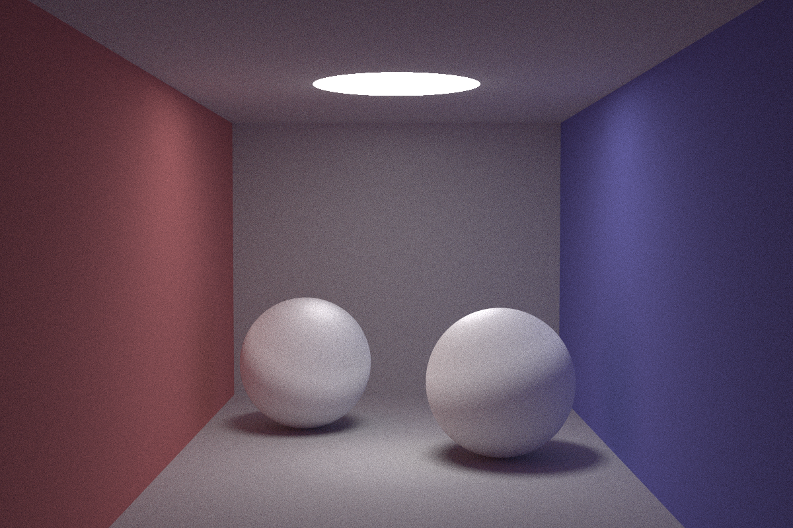

# rust-raytrace
## abstract
[三葉レイちゃん]()のこちらの動画
[【レイトレ】CG技術系バーチャルYoutuber、レイトレーシングしてみた](https://www.youtube.com/watch?v=4XeJEDuhyPs&t=379s)
を受講して、Rustでレイトレーシング を実装しました！

## result
spp = 1000
reflectance = 10

spp = 1500
reflectance = 12
