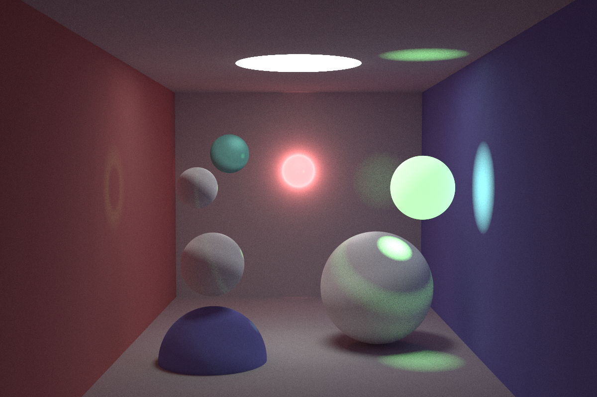
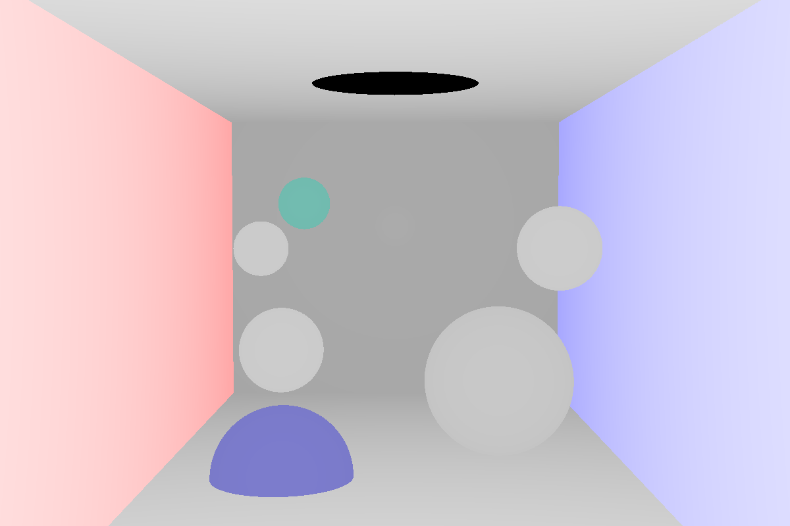
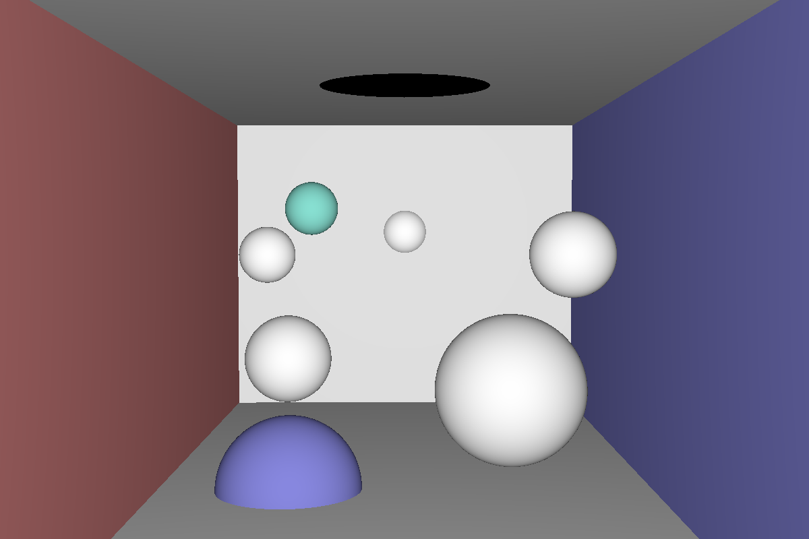
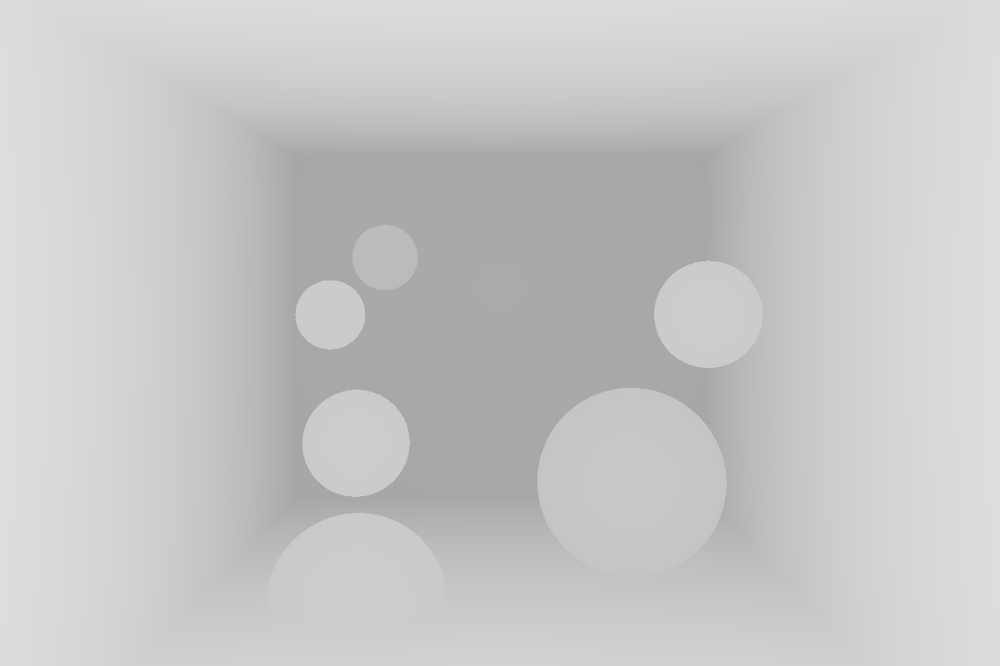

# rust-raytrace
## abstract
[三葉レイちゃん](https://twitter.com/mitsuba_rei)のこちらの動画
[【レイトレ】CG技術系バーチャルYoutuber、レイトレーシングしてみた](https://www.youtube.com/watch?v=4XeJEDuhyPs&t=379s)
を受講して、Rustでレイトレーシングを実装しました！

## result
spp = 1000, reflectance_num = 10

spp = 5000, reflectance_num = 10

spp = 3000, reflectance_num = 20

Normal, Reflectance, Depth

Normal, Reflectance

Depth
